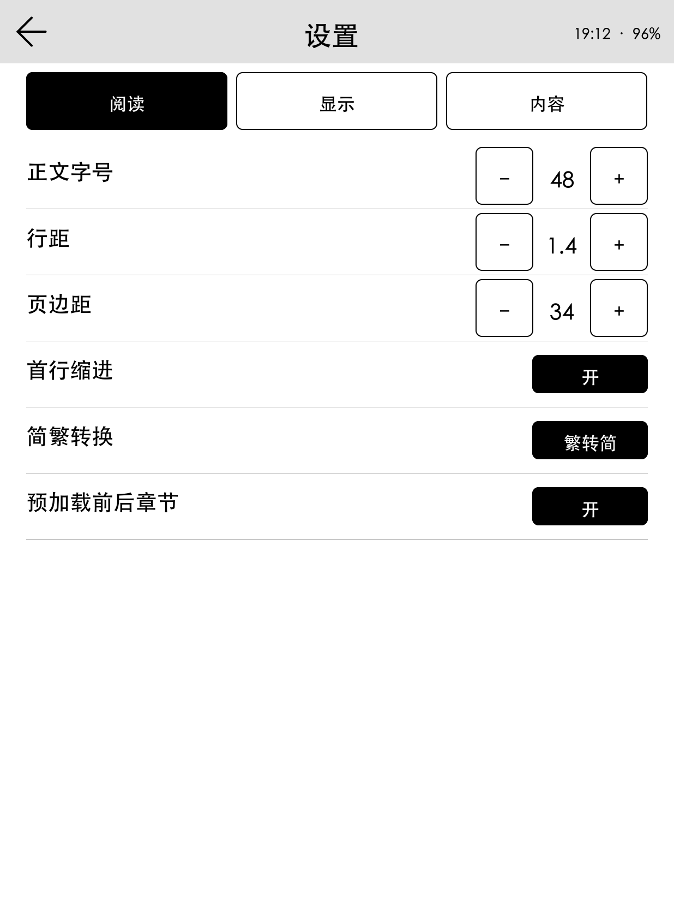

<div align="center">

# KinNovel

**在 Kindle 上安静地读轻书架。**

一个约 3.5 MB 的原生程序 · 直接驱动电子墨水屏 · 不依赖 Python、浏览器或 KOReader

[下载 1.0.0](https://github.com/mmnnwjw/KinNovel/releases/latest) &nbsp;·&nbsp; [安装](#安装) &nbsp;·&nbsp; [使用](#使用) &nbsp;·&nbsp; [配置](#配置) &nbsp;·&nbsp; [构建](#构建)

<br>

&nbsp;&nbsp;


<sub>Kindle Paperwhite 5 实机截图 · 内容来自设备上的阅读缓存</sub>

</div>

<br>

## 关于

KinNovel 是 [轻书架](https://www.lightnovel.life) 的 Kindle 客户端，运行在越狱后的 Kindle 原生系统上，由 KUAL 启动。

它把整块屏幕交给阅读：正文使用站点下发的章节字体与中文标点禁则排版，翻页只刷新需要变化的像素，菜单与列表都为手指和电子墨水的节奏设计——大触控区域、清晰的黑白层次、尽量少的闪屏。

1.0 是一次从零开始的 Rust 重写。

| | 0.8（Python） | 1.0（Rust） |
|:--|:--|:--|
| 运行时 | πthon + Pillow + lxml + FreeType，约 40 MB | 单个静态二进制，约 3.5 MB |
| 前置依赖 | KUAL + πthon for Kindle | 只需 KUAL |
| 翻页（KPW5） | ≈ 41 ms | ≈ 11 ms |
| 屏幕驱动 | 按机型手写 ioctl | [FBInk](https://github.com/NiLuJe/FBInk)，覆盖全部 Kindle 机型 |

阅读进度、章节与字体缓存、登录状态和 `config.json` 与 0.8 完全兼容：覆盖安装后，从上次停下的那一行继续。

<br>

## 功能

**阅读** &nbsp; 先出第一页、后台继续排版的渐进式分页 · 章节字体 + 系统字体回退 · 正文插图 · 上一章 / 下一章 / 目录 · 字号与夜间模式随手切换 · 多设备进度取最远的一页并回传服务器

**书架** &nbsp; 「继续阅读」一触即回 · 登录后显示云端书架 · 断网或服务器异常时自动退回本地缓存，已缓存的书照常可读

**发现** &nbsp; 最新 · 日 / 周 / 月排行 · 分类 · 书籍详情、目录、系列与评论 · 阅读历史

**账号** &nbsp; 配置文件自动登录与令牌刷新 · 每日签到 · 消息通知 · 公告 · 积分商城

**离线** &nbsp; 章节、字体、封面与插图写入磁盘缓存 · 可选预加载前后章节 · 按容量上限自动清理

**屏幕与电源** &nbsp; 差分区域刷新与残影预算 · MTK 机型 REAGL 翻页 · 按压反馈 · 休眠时让出屏幕、唤醒后完整恢复

<table>
  <tr>
    <td width="33%"></td>
    <td width="33%"></td>
    <td width="33%"></td>
  </tr>
  <tr>
    <td align="center"><sub>阅读菜单</sub></td>
    <td align="center"><sub>已缓存章节</sub></td>
    <td align="center"><sub>设置</sub></td>
  </tr>
</table>

<br>

## 安装

> 需要：已越狱的 Kindle（固件 5.x）与 [KUAL](https://www.mobileread.com/forums/showthread.php?t=203326)。

1. 从 [Releases](https://github.com/mmnnwjw/KinNovel/releases/latest) 下载 `KinNovel-v1.0.0.zip` 并解压。
2. USB 连接 Kindle，把 `KinNovel` 文件夹**里的内容**复制到 `extensions/kinnovel/`：

   ```text
   extensions/kinnovel/
   ├── bin/
   │   ├── kinnovel         原生程序
   │   ├── kinnovel.sh      启动脚本
   │   └── config.json      配置
   ├── config.xml
   ├── menu.json
   └── …
   ```

3. 可选：在 `bin/config.json` 里填写账号。不填也能浏览公开内容、阅读本地缓存。

   ```json
   { "account_email": "you@example.com", "account_password": "••••••" }
   ```

4. 打开 KUAL → **KinNovel**。

**从 0.8 升级**：直接覆盖即可。旧版的 Python 运行时（`bin/src`、`bin/lib`、`bin/vendor`、`bin/app.py`、`bin/start.sh` 等）已不再需要，可以删除；通过 SSH 运行包内的 `install.sh` 会自动清理，并保留现有配置。

<br>

## 使用

底部四个标签：**书架 · 历史 · 发现 · 我的**。二级页面左上角的箭头返回。

| 阅读时 | |
|:--|:--|
| 点左侧 · 右滑 · 翻页键「后」 | 上一页，章首时进入上一章末页 |
| 点右侧 · 左滑 · 翻页键「前」 | 下一页，章末时进入下一章 |
| 点中间 · 下滑 | 菜单：返回、回到书架、换章、目录、字号、夜间模式 |
| 上滑 · 点菜单外 | 收起菜单 |

列表页上下、左右滑动都可以翻页。退出请用「我的 → 退出」，系统界面会自动恢复。

<br>

## 配置

`/mnt/us/extensions/kinnovel/bin/config.json`，与 0.8 共用同一份文件。常用项都能在「我的 → 设置」里修改，改动立即保存。

| 键 | 含义 | 默认 |
|:--|:--|:--|
| `account_email` · `account_password` | 账号，启动时自动登录（明文保存在设备上，勿外传） | 空 |
| `font_size` · `line_spacing` · `reader_margin` | 字号 · 行距 · 左右边距 | `48` · `1.42` · `34` |
| `first_line_indent` | 首行缩进 | `true` |
| `convert` | 简繁转换：`null` · `"t2s"` · `"s2t"` | `null` |
| `prefetch_chapters` | 后台预加载前后章节 | `false` |
| `night_mode` | 夜间模式 | `false` |
| `page_flash` · `full_refresh_every` | 每页全刷 · 每隔多少屏全刷一次清残影 | `false` · `6` |
| `ignore_japanese` · `ignore_ai` | 列表中隐藏日文 / AI 翻译作品 | `false` |
| `cache_limit_mb` | 缓存上限，启动时按最近使用清理 | `192` |
| `font_path` | 界面与回退用的系统中文字体 | `STHeitiMedium.ttf` |
| `api_server` · `strict_tls` | API 地址 · 严格校验证书 | 官方地址 · `true` |

<details>
<summary>排障</summary>

<br>

- 日志：`extensions/kinnovel/logs/kinnovel.log`。
- 提示已在运行却没有界面：删除 `/tmp/kinnovel.lock` 后重启。
- 正文成了乱码：章节字体需要联网下载一次；离线且未缓存时会提示。
- 残影偏多：在设置里调小「残影清理间隔」，或打开「翻页全屏刷新」。

</details>

<br>

## 现状

- 已在 **Kindle Paperwhite 5（FW 5.17.1）** 上实机验证：阅读、翻页、插图、菜单、设置、夜间模式、休眠与唤醒、退出恢复，以及服务器不可用时的降级。其他机型由 FBInk 适配，尚未实测——欢迎反馈。
- 1.0 发布时轻书架服务器正处于故障。联网页面依照接口契约实现，并用合成数据完成离线测试，真实联调将在服务器恢复后进行；遇到联网问题请提 Issue。
- 0.8 的书架编辑（加入 / 移出、文件夹）与插图全屏预览尚未移植。

<br>

## 构建

```bash
git clone --recursive https://github.com/mmnnwjw/KinNovel.git
cd KinNovel/rust
./build.sh kindle       # armv7 musl 静态二进制（cargo-zigbuild）
./build.sh host-test    # 单元测试
./build.sh host         # 主机预览：kinnovel --preview out.pgm [--tap X,Y]…
python ../tools/package_release.py
```

| crate | 职责 |
|:--|:--|
| `kn-render` | 灰度位图、字体解析与文字渲染、图片解码 |
| `kn-platform` | FBInk 显示、触摸手势、按键与电源事件 |
| `kn-ui` | 即时模式页面、刷新调度、后台任务 |
| `kn-text` | HTML → 文本块、禁则断行、渐进分页、阅读位置锚点 |
| `kn-net` | SignalR 客户端、限流、令牌与缓存 |
| `kn-app` | 各页面与本地存储 |

设计文档：[`rust/DESIGN.md`](rust/DESIGN.md) · [`rust/UI-DESIGN.md`](rust/UI-DESIGN.md)。0.8 的 Python 实现保留在 [`legacy`](https://github.com/mmnnwjw/KinNovel/tree/legacy) 分支。

<br>

## 致谢

[LightNovelShelf/Web](https://github.com/LightNovelShelf/Web) —— 接口契约、阅读位置语义与章节字体模型 &nbsp;·&nbsp;
[FBInk](https://github.com/NiLuJe/FBInk) —— 电子墨水屏驱动（GPL-3.0，静态链接） &nbsp;·&nbsp;
[KOReader](https://github.com/koreader/koreader) 与 [kComics](https://github.com/lxdklp/kComics) —— 电源事件、刷新策略与 KUAL 启动流程的参考

第三方组件与许可见 [`THIRD-PARTY-NOTICES.md`](THIRD-PARTY-NOTICES.md)。

<br>

<div align="center">
<sub>KinNovel 1.0 由 Claude Opus 5.5 与 Claude Sonnet 5.5 编写 &nbsp;·&nbsp; 以 <a href="LICENSE">GPLv3</a> 发布</sub><br>
<sub>轻书架的内容、封面、正文与字体归原站及权利人所有</sub>
</div>
