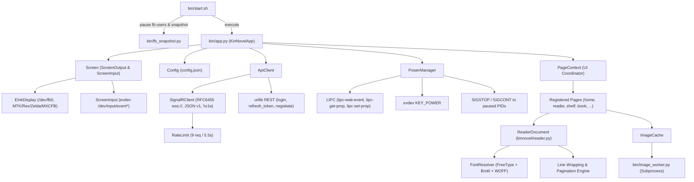

# KinNovel C++ 重构技术分析报告 (ANALYSIS.md)

本文档基于 KinNovel Python 参照实现（版本 `v0.6.0`，包含全部源码 `bin/`、测试 `tests/` 与开发工具 `tools/`），全面梳理系统的架构、对外契约、硬件特性、未记录行为与风险点，为 C++17 重构提供严格的技术基线。

---

## 目录
1. [模块清单与职责边界](#1-模块清单与职责边界)
2. [调用关系与运行时拓扑](#2-调用关系与运行时拓扑)
3. [对外接口契约全集](#3-对外接口契约全集)
   - 3.1 REST 端点契约
   - 3.2 SignalR Hub 通信协议与数据帧规范
   - 3.3 Hub 业务方法与字段全量清单
4. [线程与异步并发模型](#4-线程与异步并发模型)
5. [缓存与限流策略](#5-缓存与限流策略)
6. [各机型兼容补丁与硬件 Workarounds](#6-各机型兼容补丁与硬件-workarounds)
7. [配置项全集与行为规范](#7-配置项全集与行为规范)
8. [未在 README 中记录的行为与硬编码常量全集](#8-未在-readme-中记录的行为与硬编码常量全集)
9. [技术风险评估与最高风险 Top 3](#9-技术风险评估与最高风险-top-3)

---

## 1. 模块清单与职责边界

| 模块文件 | 层次 | 核心职责 | 核心依赖 |
|---|---|---|---|
| `bin/app.py` | 启动与运行时组合 | 应用生命周期入口、日志滚动（1MB截断至512KB）、屏幕与触控初始化、字体装载、页面注册、主输入分发循环、电源事件协同、优雅关机 | `screen`, `kinnovel.*`, `PIL` |
| `bin/fb_snapshot.py` | 启动前驱工具 | 独立脚本：保存 `/dev/fb0` 原始内容到快照文件，退出时写回并触发全屏 GC16 刷新 | `screen.output.framebuffer` |
| `bin/image_worker.py` | 独立辅助进程 | 子进程方式下载并解码远程封面/正文插图至灰度 `L` PNG，隔离主进程内存，设 20M 像素上限 | `urllib`, `PIL` |
| `bin/start.sh` | Shell 运行守护 | 单实例锁目录 `/tmp/kinnovel.lock`、扫描并 `SIGSTOP` 系统进程、保存快照、加载库路径与 preloaded FreeType、启动 Python、退出 trap 恢复系统进程与快照 | `sh`, `/proc` |
| `kinnovel/config.py` | 配置管理 | JSON 配置文件加载与保存（原子替换）、字段默认值补齐、应用目录结构初始化（`cache/`, `logs/`） | `json`, `pathlib` |
| `kinnovel/utils.py` | 基础工具库 | 跨线程文件原子写入（`atomic_write`）、JSON 读写、SHA-256 计算、URL 拼接、时间格式化、LRU 缓存大小统计与修剪、电量读取（`/sys/class/power_supply/*/capacity`） | `hashlib`, `urllib.parse`, `tempfile` |
| `kinnovel/transport.py` | 网络与协议传输 | 请求限流器（`RateLimit`，滑动窗口 9次/5.5s）、RFC 6455 极简 WebSocket 客户端、ASP.NET Core SignalR JSON 协议客户端、ApiEnvelope 包装与 Gzip Base64 解包 | `socket`, `ssl`, `zlib`, `json` |
| `kinnovel/api.py` | 领域 API 客户端 | 用户 Session 管理（`session.json`）、Token 自动刷新机制（25秒阈值）、统一 Hub 调用包装、业务方法（书籍、系列、排行、书架、公告、商城等） | `kinnovel.transport`, `kinnovel.utils` |
| `kinnovel/reader.py` | 排版与阅读引擎 | HTML 清洗（`sanitize_html`）、块结构解析（`extract_blocks`）、WOFF1 SFNT 解压重构（`normalize_font`）、字体解析与字形探测（`glyph_available`，含 `_notdef` 位图比对）、标点禁则避头避尾折行（`_wrap_line_parts`）、分页算法、相对 XPath 计算与映射 | `lxml`, `PIL`, `struct`, `zlib` |
| `kinnovel/power.py` | 电源与休眠调度 | 扫描 `/proc/*/fd` 定位占用 fb 进程；监听 `com.lab126.powerd` LIPC 事件；休眠自愈看门狗；物理按键监听；休眠挂起（让出触控+恢复系统UI）与唤醒恢复（重新挂起系统UI+重新独占触控+防残影刷新） | `evdev`, `subprocess`, `signal` |
| `kinnovel/ui.py` | UI 框架与渲染抽象 | 黑白/夜间主题（`Theme`）、画布（`Canvas`，包含文本折行、按钮、标头、弹窗绘制）、封面内存 LRU 缓存（`ImageCache`，24张）、页面上下文与路由栈（`PageContext`）、异步任务派发（`run_async`） | `PIL` |
| `kinnovel/pages/home.py` | 页面：首页 | 双列功能按钮网格，根据 `home_order` 配置动态排序和隐藏；展示在线人数与登录状态；提供退出入口 | `ui` |
| `kinnovel/pages/shelf.py` | 页面：书架 | 远端扁平树结构解析、多层文件夹进出导航、分页网格、长按删除文件夹/移出书籍、与远端合并保存 | `ui`, `api` |
| `kinnovel/pages/browse.py` | 页面：最近/分类 | 排序筛选（最新/上架/点击）、类型选择、底部分页、书籍点击进入详情 | `ui`, `api` |
| `kinnovel/pages/rank.py` | 页面：排行榜 | 日榜/周榜/月榜切换、列表分页展示 | `ui`, `api` |
| `kinnovel/pages/book.py` | 页面：书籍详情 | 封面渲染、简介、标签、系列跳转、章节分页目录、加入/移出书架、预热目标阅读章节 | `ui`, `api` |
| `kinnovel/pages/series.py` | 页面：系列书籍 | 系列作品列表浏览与快速进入对应书籍详情 | `ui`, `api` |
| `kinnovel/pages/history.py`| 页面：阅读历史 | 读取历史 BookID 列表批量拉取信息、清空阅读历史 | `ui`, `api` |
| `kinnovel/pages/reader.py` | 页面：阅读器 UI | Compact 阅读视图、滑动手势唤出控件层（返回/主页/上一章/下一章/目录/设置/进度条）、翻页与章间联动、插图全屏预览、首访操作指引、阅读位置落盘与远端上传 | `ui`, `reader` |
| `kinnovel/pages/settings.py`| 页面：设置 | 字号/行距 Stepper 调节、夜间模式、简繁转换、日文/AI过滤、翻页闪屏/动画开关、缓存清理 | `ui` |
| `kinnovel/pages/account.py` | 页面：账号功能 | 依据 `config.json` 自动登录、个人资料与经验金币成长值展示、每日签到、通知中心、积分商城 | `ui`, `api` |
| `kinnovel/pages/announcements.py`| 页面：公告与评论 | 系统公告列表、公告正文解析、评论列表分页展示 | `ui`, `api` |
| `screen/output/framebuffer.py` | 底层显示驱动 | `/dev/fb0` mmap 映射；支持 `mtk`、`rex`、`zelda`、`mxcfb` 4套 ioctl 协议与结构体；8像素步长对齐；波形决策；MTK 硬件横向平移翻页动画 | `ctypes`, `fcntl`, `mmap` |
| `screen/input/parser.py` | 触控手势解析器 | 多点触控 Slot 状态追踪（Linux Multi-touch Protocol Type B）、Tap / Long-press / Swipe (Left, Right, Up, Down) 判定 | `evdev` |
| `screen/input/screen.py` | 触控输入设备 | 触控设备遍历探测（能力掩码校验）、硬件坐标归一化为比率（0.0~1.0）及屏幕像素坐标 | `evdev` |

---

## 2. 调用关系与运行时拓扑



---

## 3. 对外接口契约全集

### 3.1 REST 端点契约
LightNovelShelf 的认证、协商和多媒体下载使用 HTTP/HTTPS REST 接口：

1. **用户登录**:
   - `POST {api_server}/api/user/login`
   - Headers: `Content-Type: application/json`, `Accept: application/json`, `x-id: {visitor_id}`, `User-Agent: KinNovel/0.1`
   - Body: `{"email": "...", "password": "<SHA256(password)>"}`
   - 响应 Envelope: `{"Success": true, "Response": {"Token": "...", "RefreshToken": "..."}, "Status": 200, "Msg": ""}`
2. **刷新令牌**:
   - `POST {api_server}/api/user/refresh_token`
   - Body: `{"token": "{RefreshToken}"}`
   - 响应 Envelope: `{"Success": true, "Response": "<new_jwt_access_token_string>", "Status": 200, "Msg": ""}`
   - 特殊状态处理：当 Status 为 `-100` 或 `404` 时，判定 RefreshToken 失效，调用 `clear_credentials()` 清空本地 Session。
3. **SignalR 协商**:
   - `POST {api_server}/hub/api/negotiate?negotiateVersion=1`
   - Headers: 包含 `Authorization: Bearer {Token}`（若已登录）以及 `x-id`。
   - 响应: `{"connectionToken": "...", "negotiateVersion": 1, ...}`
4. **字体与插图下载**:
   - `GET {font_or_image_url}`
   - Headers: `User-Agent: KinNovel/0.1` (插图工作进程中使用 `KinNovel/0.2`)
   - 尺寸优化规则：插图 URL 若含 `size=` 且未含 `height=`，客户端必须自动追加 `&height=1024`，避免拉取超大原图。

### 3.2 SignalR Hub 通信协议与数据帧规范
- **协议类型**：ASP.NET Core SignalR JSON Protocol version 1（**明确为 JSON 协议，非 MessagePack**）。
- **握手协议**：
  - 连接建立后，客户端先发送：`{"protocol":"json","version":1}\x1e`
  - 必须等待服务端返回 `{}\x1e` 确认握手完成。
- **帧分隔符**：ASCII 记录分隔符 `0x1E`（`\x1e`）。所有发送和接收的 JSON 报文必须以此结尾。
- **消息类型代码 (Type)**：
  - `1`: 调用请求（Invocation）/ 服务端下发推送（Notification）。
  - `3`: 调用完成（Completion）。
  - `6`: Ping 心跳。收到服务端的 `{"type":6}\x1e` 时，客户端必须立即回复 `{"type":6}\x1e` 维持连接。
- **调用请求结构**：
  ```json
  {
    "type": 1,
    "invocationId": "32位UUID十六进制",
    "target": "方法名",
    "arguments": [
      { "业务参数对象" },
      { "UseGzip": true }
    ]
  }
  ```
  *注：`arguments` 数组必须且严格包含两个元素，第二个元素固定为 `{"UseGzip": true}`。若缺失此参数，服务端接口将抛出内部异常。*
- **响应解包流程 (ApiEnvelope & Gzip)**：
  - 服务端返回 Completion 帧（`type: 3`），包含 `result` 字段。
  - `result` 具有标准 Envelope 结构：`{"success": true, "response": "...", "status": 200, "msg": ""}`。
  - 当 `response` 字段为 String 类型时：
    1. Base64 解码为二进制字节数组。
    2. 使用 RFC 1952 Gzip 解压（解压后安全上限限定为 **8MB**，防内存炸弹）。
    3. 将解压后的 UTF-8 文本解析为 JSON 对象。

### 3.3 Hub 业务方法与字段全量清单

| 方法名 (`target`) | 入参字段 (`arguments[0]`) | 返回核心结构 (`response`) |
|---|---|---|
| `GetBookList` | `Page` (int), `Size` (int), `Order` (string), `IgnoreJapanese` (bool), `IgnoreAI` (bool), `KeyWords`? (string), `CategoryId`? (int) | `{"Data": [BookInList], "Page": int, "TotalPages": int}` |
| `GetBookCategories`| `Type`: `"Novel"` | `[{"Id": int, "Name": str, "ShortName": str, "Color": str}]` |
| `GetRank` | `Days`: `1` (日), `7` (周), `31` (月) | `[BookInList]` |
| `GetAnnouncementList` | `Page` (int), `Size` (int) | `{"Data": [{"Id": int, "Title": str, "CreatedAt": str}], "TotalPages": int}` |
| `GetAnnouncementDetail` | `Id` (int) | `{"Id": int, "Title": str, "Content": str, "CreatedAt": str, ...}` |
| `GetBookInfo` | `Id` (int) | `{"Book": BookDetail, "Series": [BookInList], "SeriesTitle": str, "ReadPosition": ReadPosition}` |
| `GetBookListByIds`| `Ids`: `[int]` (最大24本), `Type`: `"Novel"` | `[BookInList]` |
| `GetBooksBySeries`| `SeriesName` (str), `Page` (int), `Size` (int), `Order` (str), `IgnoreJapanese` (bool), `IgnoreAI` (bool) | `{"Data": [BookInList], "Page": int, "TotalPages": int}` |
| `GetNovelContent` | `Bid` (int), `SortNum` (int), `Convert`? (`"t2s"` / `"s2t"`) | `{"Chapter": ChapterDetail, "ReadPosition": ReadPosition}` |
| `SaveReadPosition`| `Bid` (int), `Cid` (int), `XPath` (str) | `{}` |
| `GetReadPosition` | `Id` (int) | `{"ChapterId": int, "Position": str}` |
| `GetReadHistory` | `{}` | `{"Novel": [int], "Comic": [int]}` |
| `ClearReadHistory`| `{}` | `{}` |
| `GetMyInfo` | `{}` | `{"Id": int, "UserName": str, "Email": str, "Level": int, "Growth": {"Exp": int, "Coin": int, "ComicQuota": int, "ComicQuotaToday": int, "SignStreak": int}}` |
| `GetNotifications`| `Page` (int), `Size` (int) | `{"Data": [{"Id": int, "Title": str, "Body": str, "IsRead": bool}], "Page": int, "TotalPages": int}` |
| `MarkNotifications`| `Ids`: `[int]` | `{}` |
| `GetBookShelf` | `{}` | `{"data": [ShelfItem], "ver": str}` |
| `SaveBookShelf` | `data`: `[ShelfItem]`, `ver`: `"20260921"` | `{}` |
| `SignIn` | `{}` | `{"Reward": int, ...}` |
| `GetShop` | `{}` | `{"Coin": int, "Items": [{"Key": str, "Name": str, "Price": int, "Owned": int}]}` |
| `GetMyItems` | `{}` | `{"Items": [...]}` |
| `BuyShopItem` | `Key` (str), `Quantity`: `1` | `{}` |
| `GetComments` | `Type` (str), `Id` (int), `Page` (int) | `{"Data": [...], "TotalPages": int}` |

**核心数据结构定义**：
- `BookInList`: `Id`, `Title`, `UserName` (作者), `Cover`, `LastUpdatedAt`, `Category`
- `ChapterDetail`: `Id`, `BookId`, `BookName`, `Title`, `Content` (HTML), `SortNum`, `Chapters` (章节名数组), `Font` (WOFF字体下载地址)
- `ReadPosition`: `ChapterId`, `Position` (相对 XPath，例如 `./p[3]`)
- `ShelfItem`: 
  - 小说项: `{"type": "NOVEL", "id": 123, "index": 0, "parents": ["uuid1"]}`
  - 文件夹项: `{"type": "FOLDER", "id": "uuid2", "title": "名", "index": 1, "parents": []}`

---

## 4. 线程与异步并发模型

系统运行于多线程协同环境，必须具备严格的互斥与状态隔离：

1. **主线程 (UI 线程)**：
   - 运行 evdev 触摸事件捕获循环 `ScreenInput.listen`。
   - 收到手势（`tap`、`long`、`down`）后，同步执行页面状态变更与画布重绘，调用 framebuffer 输出。
2. **异步工作线程 (`run_async`)**：
   - 所有网络请求（REST / Hub）、磁盘密集型读取、FreeType 排版预热均必须在后台线程执行。
   - **页面隔离校验**：异步操作回调执行前，必须检验 `context.page_name == owner_page`。若用户已跳出当前页面，丢弃回调更新，杜绝竞态导致的错页。
3. **独立辅助进程 (`image_worker.py`)**：
   - 图片下载与缩放解码在独立子进程中完成，内存安全隔离，退出即彻底回收内存。
4. **电源守护线程组 (`PowerManager`)**：
   - `lipc-power-listener` 线程：管道长阻塞监听 `lipc-wait-event -m com.lab126.powerd goingToScreenSaver,outOfScreenSaver`。
   - `powerd-sleep-watchdog` 线程：每隔 2.0s 执行 `lipc-get-prop com.lab126.powerd state`。若检测到连续非休眠态，补发电源键（`lipc-set-prop -i com.lab126.powerd powerButton 1`）并在两次异常后自愈唤醒。
   - `key-power-*` 线程：独占轮询 `/dev/input/event*` 中的 `KEY_POWER` / `KEY_POWER2` 按键事件。
5. **互斥锁与保护区**：
   - `EInkDisplay._show_lock`：保护 framebuffer mmap 写入与 EPDC ioctl 提交，防止多线程刷新踩踏。
   - `SignalRClient._lock` (递归锁)：保护 WebSocket 发送与接收缓冲区、连接状态。
   - `_ATOMIC_WRITE_LOCKS`：对同一文件路径的跨线程原子写入进行序列化。
   - `_CHAPTER_LOCKS`：对同书同章节同简繁模式的请求做单飞加锁（Single-flight lock），避免重复下载。

---

## 5. 缓存与限流策略

### 5.1 网络限流器 (`RateLimit`)
- **算法**：滑动窗口（Sliding Window）限流。
- **参数**：默认 `9` 次请求 / `5500ms` 时间窗口（对应配置 `request_limit` 与 `request_window_ms`）。
- **行为**：每次发起 Hub 调用前阻塞调用 `RateLimit.wait()`。维护请求单调时间戳队列；当窗口满载时，条件变量休眠至最早时间戳滑出窗口加 `20ms` 抖动。

### 5.2 内存缓存
- **字体字形缓存 (`_GLYPH_CACHE`)**：最多保留 40,000 个字形可用性探测结果，超限全量清空。
- **封面图像缓存 (`ImageCache`)**：基于 LRU 队列，最大驻留 24 张已解码为 8bpp `L` 模式的图像。
- **阅读器适应图缓存 (`STATE["fitted_cache"]`)**：阅读器内已根据屏幕适配缩放的正文插图，最多保留 8 张。
- **设备电量缓存 (`battery_level`)**：缓存有效周期 60 秒。

### 5.3 磁盘存储与淘汰机制 (LRU Pruning)
- **目录规划**：
  - `cache/covers/`: 封面图片，文件名 `sha256(url).png`。
  - `cache/fonts/`: 章节字体，文件名 `sha256(url).{ttf|otf|woff|woff2}`。
  - `cache/images/`: 正文插图。
  - `cache/content/`: 章节 JSON，文件名 `sha256(book_id:sort_num:convert).json`，具有 **12 小时** 的有效刷新期（`_CHAPTER_CACHE_TTL = 12 * 3600`）。离线断网时自动回退使用过期缓存。
  - `cache/progress/`: 阅读进度 `<book_id>-<sort_num>.json`。
- **LRU 访问维护**：每次命中缓存文件时，同步调用 `touch(path)` 刷新文件 `st_mtime`。
- **磁盘配额修剪 (`prune_cache`)**：
  - 依据配置项 `cache_limit_mb`（默认 192MB），分为 `covers`, `fonts`, `images`, `content` 四个子目录，每个子目录限额为 `limit // 4`。
  - 递归扫描子目录按 `st_mtime` 升序排序，从最旧的文件逐个删除直至低于定额，并递归清理空目录。

---

## 6. 各机型兼容补丁与硬件 Workarounds

### 6.1 EPDC 协议探测与 ioctl 命令字
Kindle 各代硬件的 E-Ink 控制器差异极大，ioctl 命令编号取决于结构体大小：

| 平台代号 | 典型设备 | ioctl 结构体 | 结构体大小 | `send_update` ioctl 编码 |
|---|---|---|---|---|
| `mtk` | Paperwhite 5 (Bellatrix), Kindle 11 | `MxcfbUpdateDataMtk` | 96 字节 | `0x4060462E` (`_IOW('F', 0x2E, 96)`) |
| `rex` | Paperwhite 4 (Rex), Kindle Touch 4 | `MxcfbUpdateDataRex` | 80 字节 | `0x4050462E` (`_IOW('F', 0x2E, 80)`) |
| `zelda`| Kindle Oasis 2, Oasis 3 (i.MX7D) | `MxcfbUpdateDataZelda` | 88 字节 | `0x4058462E` (`_IOW('F', 0x2E, 88)`) |
| `mxcfb`| Paperwhite 2/3, Voyage, KT2/3 | `MxcfbUpdateData` | 68 字节 | `0x4044462E` (`_IOW('F', 0x2E, 68)`) |

- **探测顺序**：当 `screen_protocol` 为 `"auto"` 时，严格遵循 `["mtk", "rex", "zelda", "mxcfb"]` 顺序尝试。
- **边界对齐 (8 像素步长)**：更新矩形 `(x, y, w, h)` 必须向下取整对齐 `x = (x // 8) * 8`，尺寸向上取整对齐，防止边缘产生刷新盲区残影。
- **波形策略**：
  - 全刷 (`is_flashing=True`) 强制使用 `GC16` 类波形。
  - 局部刷新保持 `GC16` + `PARTIAL` 实现无闪清晰刷新。
  - `rex` / `zelda` 硬件强制注入环境温度标志：`TEMP_USE_AMBIENT = 0x1000`。
- **MTK 原生翻页平移硬件动画**：
  - 仅在 `mtk` 平台生效，需设置 `flags |= 0x10000 (FLAG_MTK.ENABLE_SWIPE)`。
  - 步进固定为 `swipe_steps = 12`。方向枚举：向左 `SWIPE_MTK.LEFT = 2`，向右 `SWIPE_MTK.RIGHT = 3`。波形强制指定为 `WAVEFORM_MTK.REAGL`。

### 6.2 系统进程接管与恢复
Kindle 原生 UI（`awesome`、`lipc` 管理器）会持有 `/dev/fb0`。
- 启动/唤醒时：扫描 `/proc/*/fd` 中指向 `/dev/fb0` 的所有外部 PID，发送 `SIGSTOP` 暂停，并将 PID 持久化记录到 `/tmp/kinnovel_paused_pids`。
- 休眠/退出时：对上述记录的所有 PID 发送 `SIGCONT` 恢复系统运行，并调用 `lipc-set-prop com.lab126.appmgrd start app://com.lab126.booklet.home` 恢复桌面。
- 触控独占：启动与唤醒必须对触摸屏设备调用 `ioctl(EVIOCGRAB, 1)`（`grab()`），休眠挂起时必须调用 `ioctl(EVIOCGRAB, 0)`（`ungrab()`）让渡给锁屏画册。

---

## 7. 配置项全集与行为规范

| 字段 | 类型 | 默认值 | 行为与取值范围 |
|---|---|---|---|
| `api_server` | string | `"https://api.lightnovel.life"` | API 服务端基础根路径，末尾斜杠会自动剔除 |
| `account_email` | string | `""` | 登录邮箱，留空则不执行自动登录 |
| `account_password`| string | `""` | 明文密码，内存中计算 SHA256 发往服务器 |
| `screen_protocol` | string | `"auto"` | 可选 `"auto"`, `"mtk"`, `"rex"`, `"zelda"`, `"mxcfb"` |
| `framebuffer` | string | `"/dev/fb0"` | 帧缓冲设备文件节点 |
| `font_path` | string | `"/usr/java/lib/fonts/STHeitiMedium.ttf"` | Kindle 原生系统 CJK 字体路径，用于缺字回退与 UI |
| `font_size` | int | `48` | 正文字号（px），阅读器标题根据字号动态缩放 |
| `line_spacing` | float | `1.42` | 行间距系数，行高为 `font_size * line_spacing` |
| `reader_margin` | int | `34` | 阅读页正文左/右安全边距（px） |
| `page_flash` | bool | `false` | 是否每次翻页均进行 EPDC 闪屏（GC16 FULL）刷新 |
| `page_turn_animation` | bool | `true` | 是否启用 MTK 原生横向平移翻页动画 |
| `reader_guide_dismissed` | bool | `false` | 阅读器首次手势指引弹窗是否不再提示 |
| `night_mode` | bool | `false` | 夜间反色模式（黑底白字） |
| `justify` | bool | `false` | 两端对齐开关 |
| `first_line_indent`| bool | `true` | 段落首行缩进（缩进两全角空格 `"　　"`） |
| `convert` | string/null | `null` | 简繁转换：`null`（不转换）、`"t2s"`（繁转简）、`"s2t"`（简转繁） |
| `ignore_japanese` | bool | `false` | 书库列表筛选是否排除日文作品 |
| `ignore_ai` | bool | `false` | 书库列表筛选是否排除 AI 生成作品 |
| `prefetch_chapters`| bool | `false` | 是否在阅读时后台异步预取前后各一章正文与字体 |
| `request_limit` | int | `9` | 滑动窗口请求数上限 |
| `request_window_ms`| int | `5500` | 滑动窗口时间跨度（毫秒） |
| `cache_limit_mb` | int | `192` | 磁盘总缓存上限（MB） |
| `strict_tls` | bool | `true` | 是否严格校验证书；为 `false` 时跳过证书校验 |
| `check_update` | bool | `true` | 预留检查更新开关 |
| `home_order` | object | 字典映射 | 首页各模块展示顺序与隐藏（负数隐藏，数值升序排列） |

---

## 8. 未在 README 中记录的行为与硬编码常量全集

在通读 Python 源码及测试代码后，发现以下未在文档与 README 中显式记录的隐含逻辑与硬编码数值：

1. **不可见字符剥除正则**：
   - 包含：`\u200b` (零宽空格), `\u200c` (零宽非断字符), `\u200d` (零宽连接符), `\ufeff` (BOM/零宽非断空格), `\u00ad` (软连字符), `\u2060` (单词连接符)。
   - 排版引擎必须无条件剔除上述字符，否则部分字体会将它们画成方框（`notdef`）。
2. **标点禁则完整集合与悬挂逻辑**：
   - 行首禁则（闭标点）：`，。、；：？！,.!?;:'\")]】》”’%…—·`
   - 行尾禁则（开标点）：`（《【「『“‘([{"`
   - **单标点悬挂规则**：当遇到单个行首禁则标点导致超出行宽时，允许挂在当前行末尾（悬挂标点），不折入下一行；若连续多个禁则标点，才执行回退前推换行。
3. **字体缺字与 `.notdef` 方框识别**：
   - 部分 FreeType 字体缺字时 `getmask(char).getbbox()` 返回非空（绘制了带描边的方框）。
   - 解决方案：生成 `\U0010FFFF` 的字符位图字节，若待测字符生成的灰度位图与之完全相同，判定为缺字，必须切换回退字体。
4. **HTML 标签处理与清洗规则**：
   - 剥除标签：`script`, `style`, `iframe`, `object`, `embed`, `svg`, `canvas`。
   - 剥除属性：所有以 `on` 开头的属性，以及 `style`, `srcset`。
   - 属性安全：`<a>` 标签若 `href` 以 `javascript:` 或 `data:` 开头则强行删除。
   - 块级标签识别：`p, div, section, article, blockquote, h1-h6, li, dt, dd, pre, figcaption, aside`。`aside` 被归类为注释块（`footnote`）。
5. **排版几何公式硬编码**：
   - 标题字号：`int(body_font.size * max(1.08, 1.30 - level * 0.05))`。
   - 标题前距：`int(line_height * 0.5)`（仅非页面第一行时生效）；后距：`int(line_height * 0.35)`。
   - 正文段落后距：`int(line_height * 0.22)`。
   - 注释后距：`int(line_height * 0.15)`。
   - 插图在正文中的尺寸分配：`image_height = min(int(usable_height * 0.62), int(usable_width * 0.72))`。
   - 小字号（页脚、注释）：`max(20, int(font_size * 0.82))`。
6. **网络安全上限**：
   - WebSocket 帧消息上限：`MAX_WEBSOCKET_MESSAGE_BYTES = 32MB`。
   - SignalR 单个分片记录上限：`MAX_SIGNALR_RECORD_BYTES = 64MB`。
   - Gzip 解压防炸弹上限：`8MB`。
   - 单次字体下载大小上限：`20MB`。
   - 单次图片下载大小上限：`8MB`。
   - 图片工作进程像素上限：`20,000,000` 像素。
   - 批量查询书籍 ID 上限：单次调用最多 24 个 ID（`len(ids) > 24` 抛出 400 错误）。
7. **阅读器交互阈值与布局常量**：
   - 顶端下滑唤出控件层：`gesture == "down"` 且起始位置 `y-ratio < 0.16`。
   - 控件层底部高度：`_CHROME_FOOTER = 92` 像素。
   - 翻页左右区域判定：左侧 `< 25% width`（上一页），右侧 `> 75% width`（下一页）。
   - 翻页防抖冷却：`time.monotonic() - last_turn_at < 0.35s` 拦截顶栏误触。
   - 返回键防抖：`0.35s`。
   - 页面回退栈深度上限：最多保存 20 级（`len(stack) > 20` 弹出栈底）。
8. **触控解析判定阈值**：
   - 点击移动容差：`tap_max_move_px = 30`。
   - 短按最长时间：`tap_max_duration_s = 0.30s`。
   - 长按最短时间：`long_press_min_duration_s = 0.5s`。
   - 滑动手势触发距离：`swipe_min_distance_px = 40`。
9. **日志与锁文件固定路径**：
   - 单实例排他锁目录：`/tmp/kinnovel.lock`（内含 `pid` 文件）。
   - 暂停系统进程清单：`/tmp/kinnovel_paused_pids`。
   - 帧缓冲恢复快照：`/tmp/kinnovel_fb.bin`。
   - 日志文件超限轮转：`kinnovel.log > 1MB` 时自动保留末尾 `512KB`。
10. **测试用例特有常量**：
    - Python 原版测试用例硬编码了 Windows 字体路径 `"C:/Windows/Fonts/simhei.ttf"`，在 Linux 无字体环境下执行单测会异常报错。C++ 原生单元测试必须脱离系统硬编码路径，采用仓库自带的脱敏测试字体。

---

## 9. 技术风险评估与最高风险 Top 3

经过全量代码与系统契约分析，从 Python 重构至 C++17 ARM 静态二进制过程中，**风险最高的 3 个技术点**明确如下：

### 风险点 1：FreeType + WOFF2 (Brotli) 逐字字形探测与排版/分页逐页黄金对齐（最高）
- **风险分析**：
  LightNovelShelf 核心防爬机制是动态下发混淆字体的 WOFF2 文件。若直接使用普通系统字体渲染，汉字将出现大面积错误映射。Kindle 原生环境不带 brotli 动态库，必须在 C++ 静态交叉编译中集成 `brotli` 与 `freetype`。
  更为严苛的是，阅读器必须逐字检测字符在混淆字体中是否存在（且不能匹配 `.notdef` 方框），缺失时回退至系统字体。排版分页算法中的禁则折行、悬挂单标点、多行段落的相对 XPath 与文本偏移映射（`offset`），任何微小的浮点数取整差异都会导致整章分页错位，无法通过阶段 2 的黄金测试（Golden Test）。
- **应对方案**：
  1. 采用 CMake FetchContent 静态集成特定版本的 FreeType 与 Google Brotli。
  2. 提取 Python 端 `_wrap_line_parts` 的精确数学模型，避免使用浮点，统一采用 FreeType 26.6 固定小数点或严格四舍五入整数像素度量。
  3. 先在 Python 端对典型章节导出每页字符流与 XPath 断点的脱敏黄金基准，C++ 单元测试严格逐字比对。

### 风险点 2：SignalR JSON 协议、RFC 6455 WebSocket 握手与 Gzip/Base64 流式解包稳定性
- **风险分析**：
  LightNovelShelf 服务端非普通 REST API，所有核心小说正文、目录与书架均运行于 ASP.NET Core SignalR 长连接之上。该协议依赖 HTTP 协商获得 `connectionToken`，再通过 WSS 建立长连接，完成 JSON 握手，并使用 `0x1e` 处理粘包/分包。更复杂的是其将 Gzip 压缩后的二进制数据进行 Base64 编码嵌在 JSON 字符串内。512MB 内存的 Kindle 设备上，若网络层解包不当或缓冲区分配失控，极易触发 OOM 或网络死锁。
- **应对方案**：
  1. 使用静态链接的 `libcurl`（支持 WebSocket）或轻量可靠的独立 RFC 6455 + `mbedtls` 实现。
  2. 实现流式 `0x1e` 缓冲区切割器，严格限定 32MB/64MB 上限。
  3. 解包管线采用：Base64 快速解码 -> `zlib` / `libdeflate` 流式解压（设 8MB 熔断保护）-> `yyjson` 快速解析。
  4. 完善断线重连、令牌过期 401 自动刷新重发机制，配合本地 Mock 服务器全覆盖断网与超时单测。

### 风险点 3：Kindle 多代硬件 EPDC 协议差异、LIPC 电源事件与无实机调试约束
- **风险分析**：
  开发者没有 Kindle 真机，无法直接连接硬件观察墨水屏效果。然而硬件涉及 4 种 ioctl 命令（MTK 96字节、Rex 80字节、Zelda 88字节、MXCFB 68字节），且休眠/唤醒依赖与 Kindle `powerd` 及 `lipc` 守护进程的复杂进程信号协同（`SIGSTOP`/`SIGCONT`、`EVIOCGRAB`）。一旦结构体字节对齐或 ioctl 编号计算有误，设备在真机上就会黑屏、卡死或唤醒无响应。
- **应对方案**：
  1. 严格使用成熟开源项目 `FBInk`（NiLuJe/FBInk）的 C 库接口封装 `IDisplay`，坚决不手写私有 ioctl。
  2. 构建健壮的硬件抽象层（HAL），在 PC / Linux 开发机上实现模拟后端（输出 PPM/PNG 图像文件或 SDL 渲染窗口），并能模拟触摸手势事件与休眠/唤醒信号。
  3. 文档中诚实标注“未实机验证”项，静态分析其内核结构体偏移，并保留调试日志输出。
